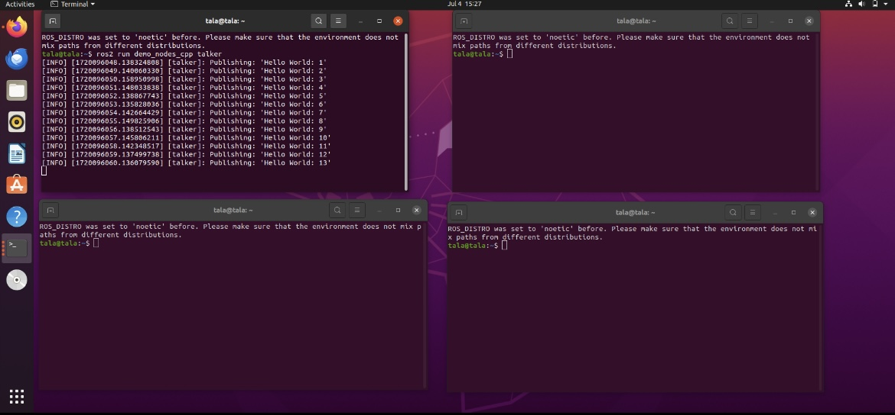
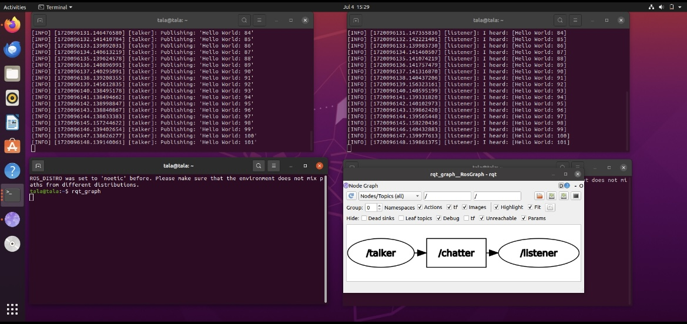
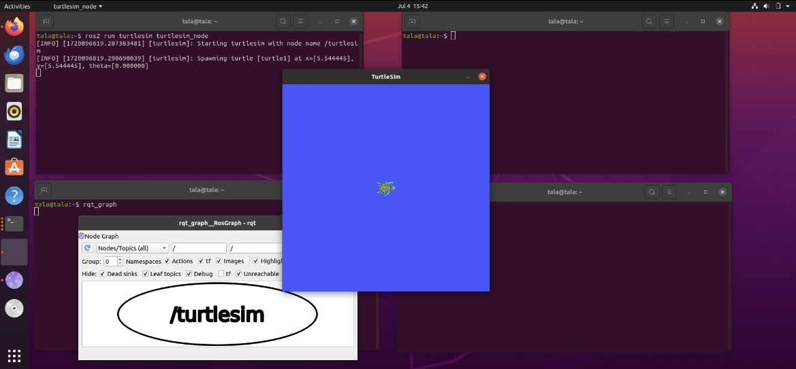
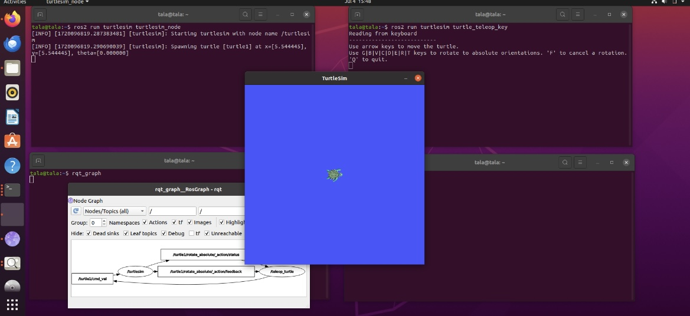

# Turtlesim Manipulation in ROS2 Foxy

### Step-by-Step Commands

To follow my process, open 4 terminal windows and execute the following commands:

1. **Open 4 Terminal Windows**

2. **Run Talker Node in the First Terminal:**

    ```bash
    ros2 run demo_nodes_cpp talker
    ```
 

3. **Run Listener Node in the Second Terminal:**

    ```bash
    ros2 run demo_nodes_cpp listener
    ```

4. **Visualize the ROS Graph in the Third Terminal:**

    ```bash
    rqt_graph
    ```

    

5. **Clear and Restart Terminals:**

    In the first and third terminals, run:

    ```bash
    clear
    ```

6. **Start the Turtlesim Node in the First Terminal:**

    ```bash
    ros2 run turtlesim turtlesim_node
    ```

    This will open the turtlesim window:

    

7. **Visualize the Updated ROS Graph in the Third Terminal:**

    ```bash
    rqt_graph
    ```

8. **Control the Turtle in the Second Terminal:**

    ```bash
    ros2 run turtlesim turtle_teleop_key
    ```

    Use the arrow keys to move the turtle around. Here are some photos of the turtle's movement:

    

### Additional Information

For a detailed video tutorial on this process, check out [this video](https://youtu.be/c5DRTN2b2kY?si=vtU9necsJewrD8Xv) which I followed to create this guide.
