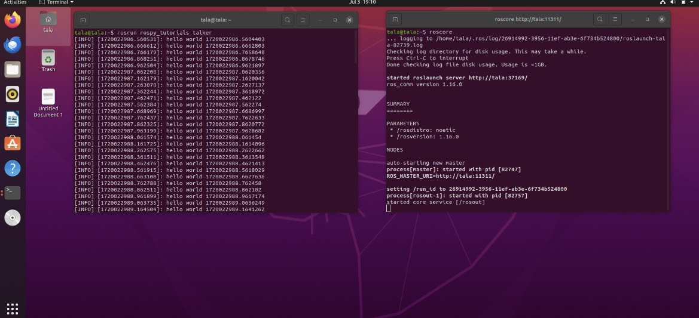
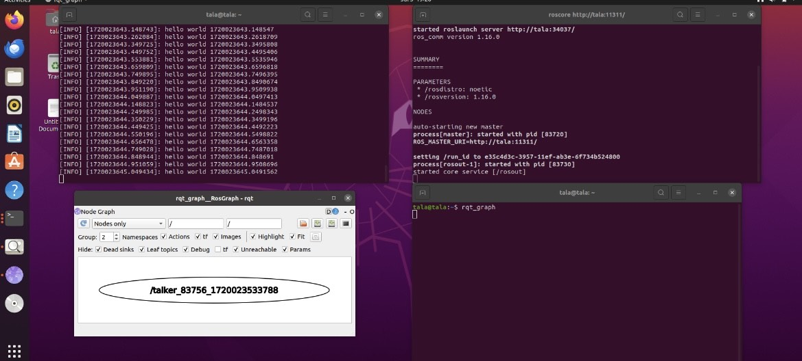
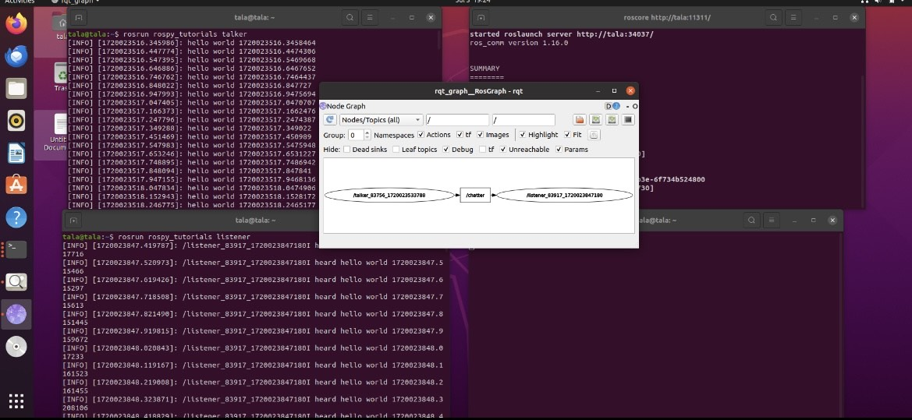
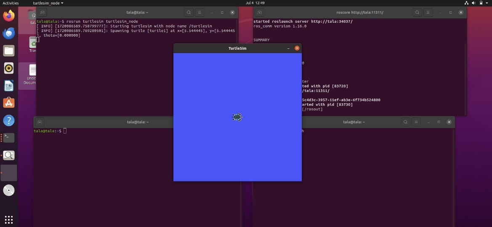
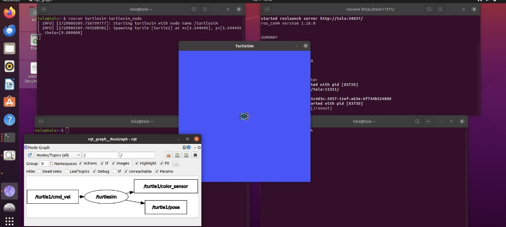
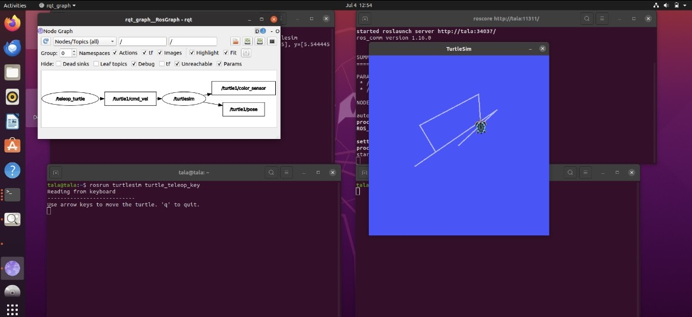

# Turtlesim Manipulation in ROS Noetic

### Step-by-Step Commands

To follow my process, open 4 terminal windows and execute the following commands:

1. **Open 4 Terminal Windows**

2. **Run ROS Master in the First Terminal:**

    
bash
    roscore

3. **Run the Talker Node in the Second Terminal:**

    
bash
    rosrun rospy_tutorials talker

    

4. **Visualize the ROS Graph in the Fourth Terminal:**

    
bash
    rqt_graph

    

5. **Run the Listener Node in the Third Terminal:**

    
bash
    rosrun rospy_tutorials listener

    

6. **Clear and Restart Terminals:**

    In the first and third terminals, run:

    
bash
    clear

7. **Start the Turtlesim Node in the First Terminal:**

    
bash
    rosrun turtlesim turtlesim_node

    This will open the turtlesim window:
    

8. **Visualize the Updated ROS Graph in the Fourth Terminal:**

    
bash
    rqt_graph

    

9. **Control the Turtle in the Third Terminal:**

    
bash
    rosrun turtlesim turtle_teleop_key

    Use the arrow keys to move the turtle around. Here are some photos of the turtle's movement:        
    

### Additional Information

For a detailed video tutorial on this process, check out [this video](https://youtu.be/4aUp2703FFY?si=7ULU46Xo4BpqVSNz) which I followed to create this guide.
